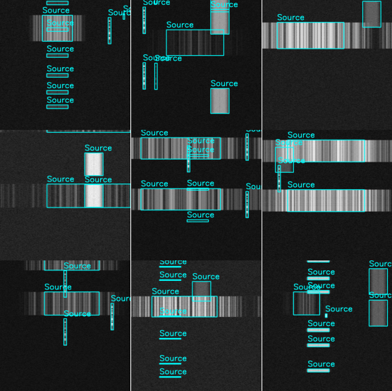

# EM Loader



`em-loader` loads an spectrogram dataset into a `tf.data.Dataset` where
each element is a tuple of Dense Tensors representing images and RaggedTensors representing the
bounding boxes contained in the images.

`em-loader` supports all of the [bounding box formats available in KerasCV](https://keras.io/api/keras_cv/bounding_box/),
and loads bounding box Tensors as RaggedTensors by default.  This format natively fits the format
required by the [KerasCV object detection API](https://lukewood.xyz/blog/sneak-peek-object-detection-api).

`em-loader` requires use of the Kaggle API.

## Quickstart

Getting started with the `em_loader` loader is as easy as:

```bash
git clone https://github.com/lukewood/em-loader
cd em-loader
python setup.py develop
```

```python
dataset = em_loader.load(
  bounding_box_format="xywh",
  split="train",
  batch_size=16
)
```

And fitting a model to the dataset is as easy as:

```python
model = keras_cv.models.RetinaNet(
    classes=1,
    bounding_box_format="xywh",
    backbone="resnet50",
    backbone_weights="imagenet",
    include_rescaling=True,
)
```

## API

The em-images API supports the following arguments:

- *bounding_box_format*: any KerasCV supported bounding box format, specified in the [Keras documentation](https://keras.io/api/keras_cv/bounding_box/)
- *data_dir*: the directory holding the data.  If you do not have a data directory, please follow the [Setup](#setup) instructions.
- *batch_size*: batch size to use

## Roadmap

- [ ] Guided setup (i.e. if the data directory is missing, give the user commands to run to set it up in Error messages)
- [ ] End to end Jupyter notebook using the loader in `examples/`
- [ ] Publish package on PyPi
